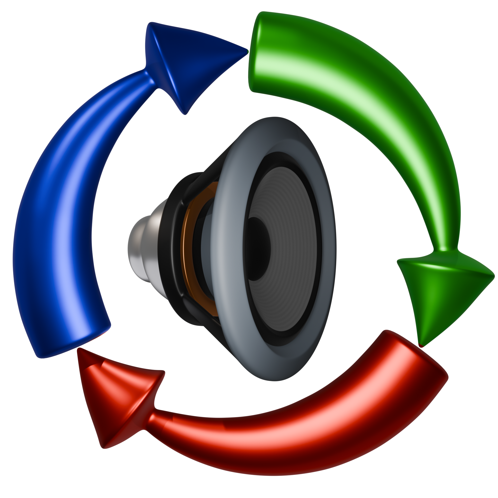
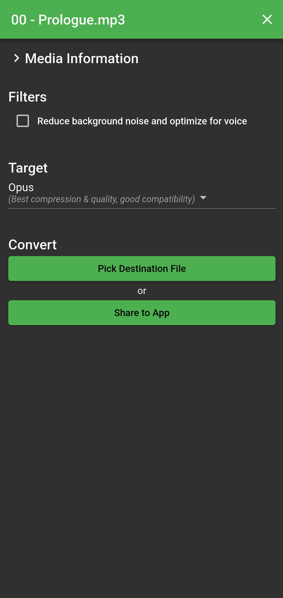
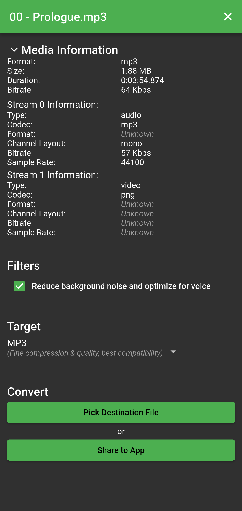

# Simple Audio Converter

A simple audio converter app for Android

https://github.com/user-attachments/assets/a857edd9-2049-43c8-8ce7-ef0cdeb1d1e6

Intended to be as simple and friendly to use as possible, potentially at the cost of some customisability.  
If you want a lot of control over all the knobs and dials of the conversion, I recommend looking for another app.

Can also receive shared files:

https://github.com/user-attachments/assets/f548e0b2-a5cb-4aa3-b505-cc478e6ea564

The UI has been cleaned up a bit since those videos were recorded,
but the core functionality has remained the same, so I haven't re-recorded them (yet).

|  |  |
|---|---|

Made with Flutter, and uses ffmpeg for the conversions.
